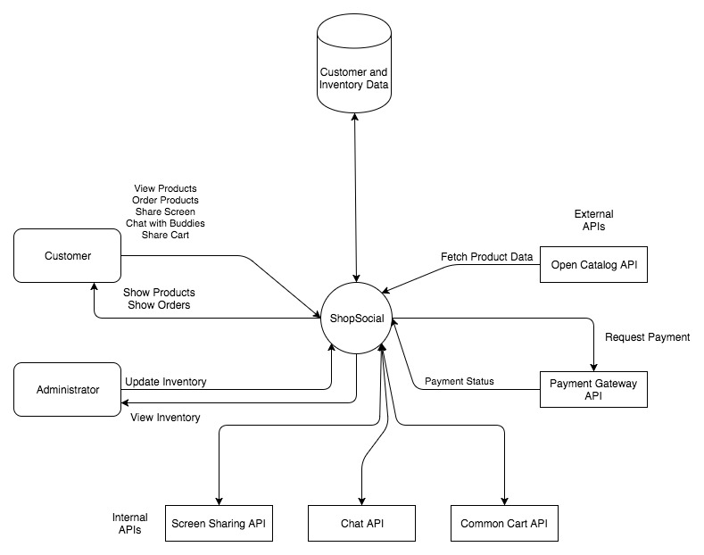
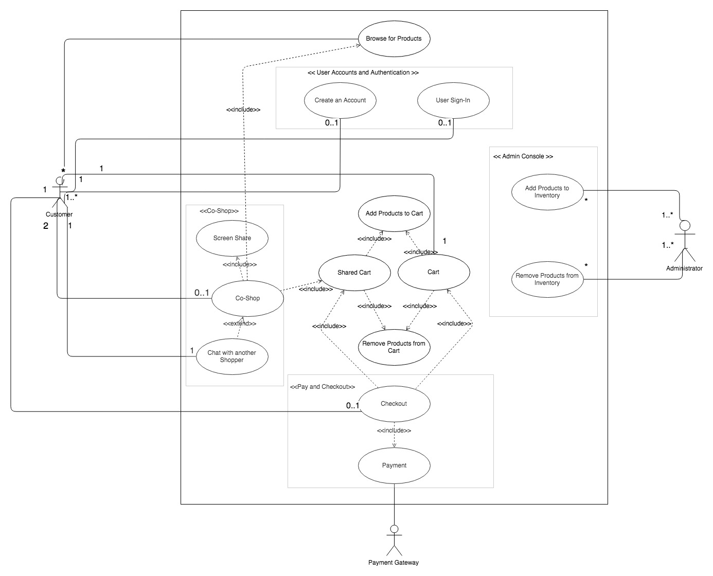
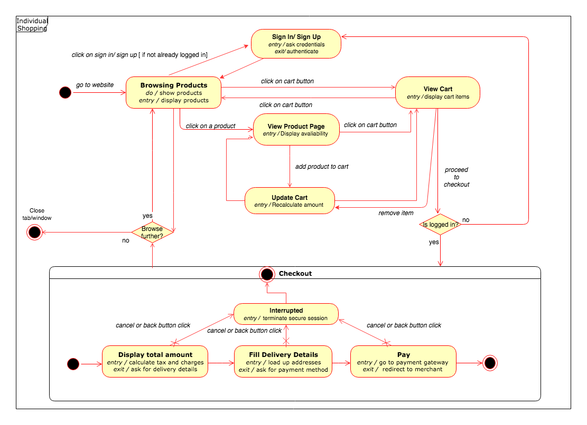
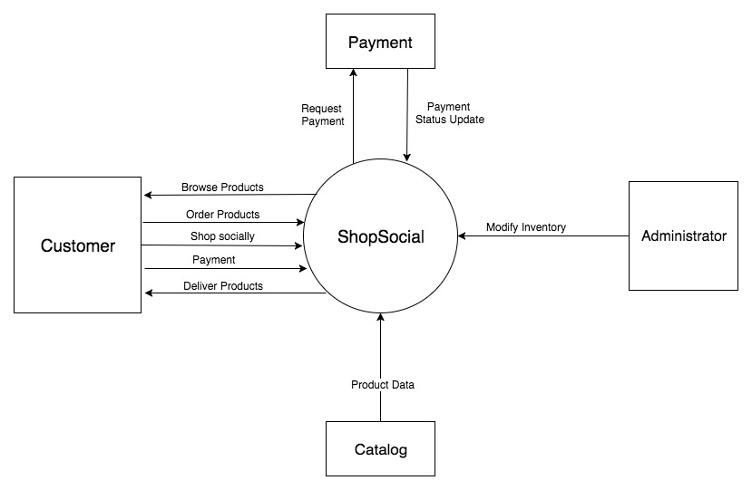
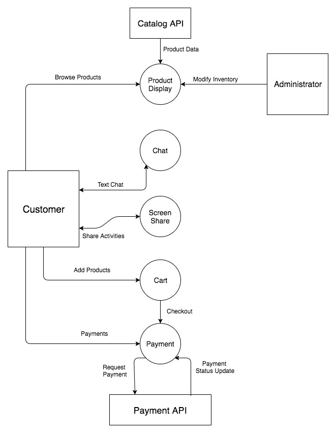
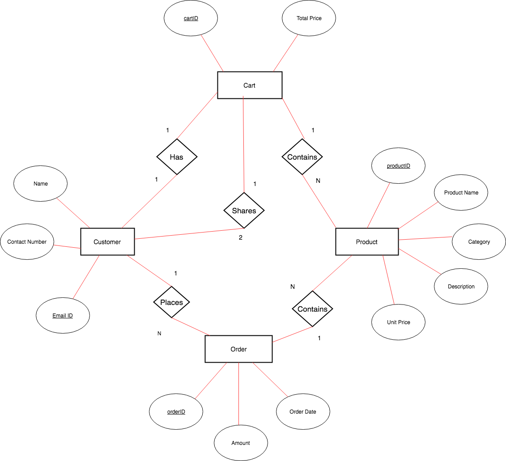

# ShopSocial

## Problem statement

Online shopping is often a solitary activity, unlike shopping in a brick and mortar store, where people have a choice of going shopping together with others. Users have to depend on other social media channels, if at all they try to interact and share their virtual shopping experience.

## Our Solution

Our solution aims to develop a software product which makes online shopping a social activity, where two users share a **common cart** and can interact with each other using a **chat** functionality, while knowing the online activity of each other via events.

## Objective

Our **ShopSocial** e-commerce application aims to provide the following basic features:

* Allow users to add a buddy to **shop together** by sharing their **browsing activities** and share a **common shopping cart**.
* Provide a text-based **chat** option to the user to chat with his/her buddies.
* Allow individual users to **browse, select and order** products on the website.

## User Stories

### Customer Management
_As a developer, I want people to be able to **create and manage their accounts** so that they can shop on the website._

**1. Customer Sign Up**

- As an unregistered customer, I want a link to a signup page so that I am able to create a new account.

- As a customer, I must be able to create an account on the website by providing my basic details and new user credentials.

**2. User Login**

- As a registered user, I want a link to login page *on all possible pages* so that I can log in to my account.

- As a registered user, I want to be able to login with my username and password so that I can access my account for shopping or viewing my profile.

**3. Logout**

-  As a developer, I want the session to end gracefully when a user logs out so that he or she stays on the same page, if permissible.

**4. Orders**

- As a customer, I would want to see both my previous as well as current orders' information.

- As a customer, I want to be able to able to cancel orders from the list of my currently placed orders.

### Administrator Management
_As an admin, I want complete access to product set on the website so that I can manage products efficiently._

**1. Administrator Login**

- As an admin, I want to be able to log in through a different portal to my account so that I can add or remove products from the website.

**2. Populate product inventory**

- As an admin, I would like to populate, initially or otherwise, my website with product data from an external API.

- As an admin, I want to be able to populate products **one-by-one** using product ID.

- As an admin, I want to be able to remove **one or more products** on display so that only *relevant and available products* are displayed.

### Product Display
_As a customer, I want to be able to view products in a convenient fashion with grouping and details as necessary._

**1. Product Links (Permalink)**

- As a customer, I want a unique link to every product in the catalog in a specified structure so that it *can be easily read and remembered by a human.*

**2. Product Category**

- As a customer,  I would want to filter the products by a **price range**.

- As a dev, I want to allow users to search for products using **only the keywords** associated with a particular product.

**3. Product View**

- As a customer, I must be able to browse and view products listed on the website.

- As a customer, I expect to be able to view information related to product like images of the product, description, specification and price.

### Cart Management
_As a shopper, I want a container to hold the products that I'm interested in buying till I check out._

**1. Addition to Cart**

- As a customer, I must be able to select product(s) I want to purchase.

**2. Updating Cart**

- As a customer, I want *an option for each product in the cart* so that I can change the number of items present in the cart.

- As a customer, I want to be able to remove items from the cart prior to checkout.

**3. Display Total and Products**

- As a customer, I want to see the total costs of items in my cart before tax and shipping charges are added.

- As a shopper, I want a user to be able to navigate to the product's page so that I can review the product in my order before check out.

**4. Social Cart**

- As a customer, I would like the items in the cart to be checked out by having **only either of the co-shoppers** to pay for it.

### Payment Management
_As a product owner, I want a customer to pay for the products in his cart so that his products are confirmed and delivered to him._

**1. Checkout**

- As a customer, I must be able to pay for all the items in the cart.

**2. Payment Options**

- As a customer, I want the option to pay using **Cash on Delivery** where I can pay by either cash or card.

**3. Co-Shop Options**

- After the payment is successful, a record/order detail must be made available to both the user(s) in case of group shopping activity.

### Chat Management
_As a user, I want to be able to chat with fellow customers so that I am able to make better shopping decisions._

**1. Chat Initiation**

- As a user, I would want to search for registered users using their **email-ids** so that I can connect and chat with them.

- As a developer, I want to *directly* connect **people who are online** so that they could start chatting instantly.

**2. Chat**

- As a customer, I want to be able to **exchange messages** with the second party I am chatting with.

- As a customer, I want to be able to **send products links** to my chat buddy with **just the click of a button** so that I can discuss with them the product I am viewing at the moment.

2. **Chat Termination**

- As a customer, I want to be able to **minimize or close** the chat window without ending the chat session.

### Shared Experience Management
_As a user, I want to be able to merge sessions to co-shop with other users._

**1. Screen Share Initiation**

- As a developer, I want a customer to be able to share his screen with **only one other person** in a session.

- As a customer, I want to be able to start sharing the activities on my screen by adding another customer by their **email address.**

**2. Screen Share**

- As a user of screen sharing, I would want my **chat window and cursor** to be decoupled from the events and activities that are shared with my fellow shopper.

**3. Shared Cart**

- As a user, I would want a **common cart** for my fellow shopper and I, so that any updates made to the common cart be reflected to each other, also enabling either to make those updates.

- As a co-shopper, I would like that, irrespective of who makes the purchase, there should be a **unique order transaction record** created which must reflect on both of their individual accounts later.

**4. Screen share termination**

- As a co-shopper, I want to be able to still browse, select and purchase products with the shared cart even if my fellow shopper _logs out or has his or her session abruptly disconnected._

- As a developer, I want to end the shared session when both of the users leave the session.
s

## Use Cases

The profound use cases of this solution are as under:

1. An administrator can **manage products** on the website using pre-defined catalog.
2. A customer can **browse for products** on the website.
3. A customer can **sign-up/sign-in** on the website.
4. A customer can **purchase** products on the website.
5. A customer can **chat with another shopper** on the website whilst shopping on the website.
6. A customer can **browse and shop** with *another shopper* on the website.

## Workflow

### 1. An administrator can manage products on the website using pre-defined catalog.
> _Actors_ – Administrator, Catalog API

> _Description_ – This use case describes how an administrator can add or remove products on the website.

#### Normal Workflow – 1.a
  1.  The administrator will sign-in to the website, on the admin portal page, by entering the email and password.
  2.	The administrator will click on the **Add Products** button on the admin console.
  3.	The administrator will select the products available from the list and specifies the inventory.
  4.  The selected products will be added to the website and available to the customers.
  5.  The administrator will sign-out of the website.

#### Normal Workflow – 1.b
  1.  The administrator will sign-in to the website, on the admin portal page, by entering the email and password.
  2.	The administrator will click on the **Remove Products** button on the admin console.
  3.	The administrator will select the products available from the list.
  4.  The selected products will be removed from the website.
  5.  The administrator will sign-out of the website.

#### Alternative Workflow -
  1. An error will be displayed on the website if API is not accessible.
  2. The administrator can retry to add or remove the products.

### 2. A customer can browse for products on the website.
> _Actors_ – Customer

> _Description_ – This use case describes how a customer can browse through the products available on the website.

#### Normal Workflow –
  1.	The customer will visit the website by specifying the URL on the browser.
  2.	The customer will be landed on the home page of the website.
  3.  The customer can browse through the website containing product listing, by interacting with the webpage.
  4.  The customer can view the description and images of the product on the product page, accessed by clicking on the product listing.

### 3. A customer can sign-up/sign-in on the website.
> _Actors_ – Customer

> _Description_ – This use case describes how a customer can browse through the products available on the website.

#### Normal Workflow – 3.a
  1.	The customer will visit the website by specifying the URL on the browser.
  2.	The customer will be landed on the home page of the website.
  3.  The customer can click on the sign-up link to access the sign-up form.
  4.  The customer will fill up the name, email, password and mobile number.
  5.  The customer will be signed-in on successful registration.

#### Normal Workflow - 3.b
  1.  The customer can click **sign-in** button on the webpage to sign-in to an account.
  2.  The customer will be signed-in on successful authentication.

#### Alternative Workflow -
  1. The customer will be greeted with an error on unsuccessful registration / unsuccessful authentication.
  2. The customer can verify the details entered to check for any errors and try again.

### 4. A customer can purchase products on the website.
> _Actors_ – Customer

> _Description_ – This use case describes how a customer can create a user account or sign-in to the website and purchase a product.

#### Normal Workflow – 3.a
  1.  The customer can click **sign-in** button on the webpage to sign-in to an account or **sign-up** button on  the webpage to create an account if it doesn't exist.
  3.  On successful registration, the customer can proceed to checkout by providing the delivery address and specifying the payment details.
  4.  The order will be confirmed on payment confirmation.

#### Alternative Workflow -
  1. The customer will be greeted with an error on unsuccessful registration / unsuccessful authentication.
  2. The customer can verify the details entered to check for any errors and try again.

### 5. A customer can chat with another shopper on the website whilst shopping on the website.
> _Actors_ – Customer One, Customer Two

> _Description_ – This use case describes how a customer can chat using text with another customer on the website, assuming the Customer One to be signed in.

#### Normal Workflow –
  1.	The customer will click the **Chat with Friend** button in the header of the website.
  2.	The customer will be asked to enter the email-ID of the friend with whom the customer wants to chat.
  3.  Based on the availability of the friend, the **chat window** will open for both the customers, allowing them to exchange text messages.
  4.  On successful completion of the chat, the chat session is terminated when either customer clicks on **End Chat** button on the chat window.

#### Alternate Workflow 5a -
  1.	When Customer One requests to have a chat with Customer Two, if the Customer Two is not available online, an error is displayed to Customer One.
  2.	Customer One's chat window will be closed.

#### Alternate Workflow 5b -
  1.	When Customer One requests to have a chat with Customer Two, if the Customer Two rejects the invite, a message explaining the same is displayed to Customer One.
  2.	Customer One's chat window will be closed.

### 6. A customer can browse and shop with another shopper on the website.
> _Actors_ – Customer One, Customer Two

> _Description_ – This use case describes how a customer can shop with another customer *when both of them are online.*

#### Normal Workflow –
  1.	The customer will click the **Shop with A Friend** button in the header of the website.
  2.	The customer will be asked to enter the email-ID of the friend with whom the customer wants to shop.
  3.  Based on the availability of that friend, a *shared session* would be created for the pair with *screen sharing* option.
  4.  Either of them can put items into a **shared cart** which would be manageable by both and separate from their own respective carts.
  5.  **Screen Sharing** feature can be enabled when the *shared session* is created.
  6.  The order for the products in the shared cart can be placed by either customer, by completing the checkout procedure.
  7.  Both of them would receive the **same order details** in their respective own individual accounts.
  8.  On successful completion of the shopping session, the share is terminated when either customer clicks on **End Share** button on the header of the website.

#### Alternate Workflow 6a -
  1.  When Customer One sends a **Co-Shop** request to Customer Two, the other shopper happens to be offline and consequently, Customer One receives a similar informative message.

#### Alternate Workflow 6b -
  1.	When Customer One sends a **Co-Shop** request to Customer Two, should Customer Two rejects the invite, a message explaining the same is displayed to Customer One.

### Architecture
  

### Use Case Diagram
  

### Activity Diagram
  

### Data Flow Context Diagram
  

### Data Flow Diagram - Level 0
  

### ER Diagram
  
